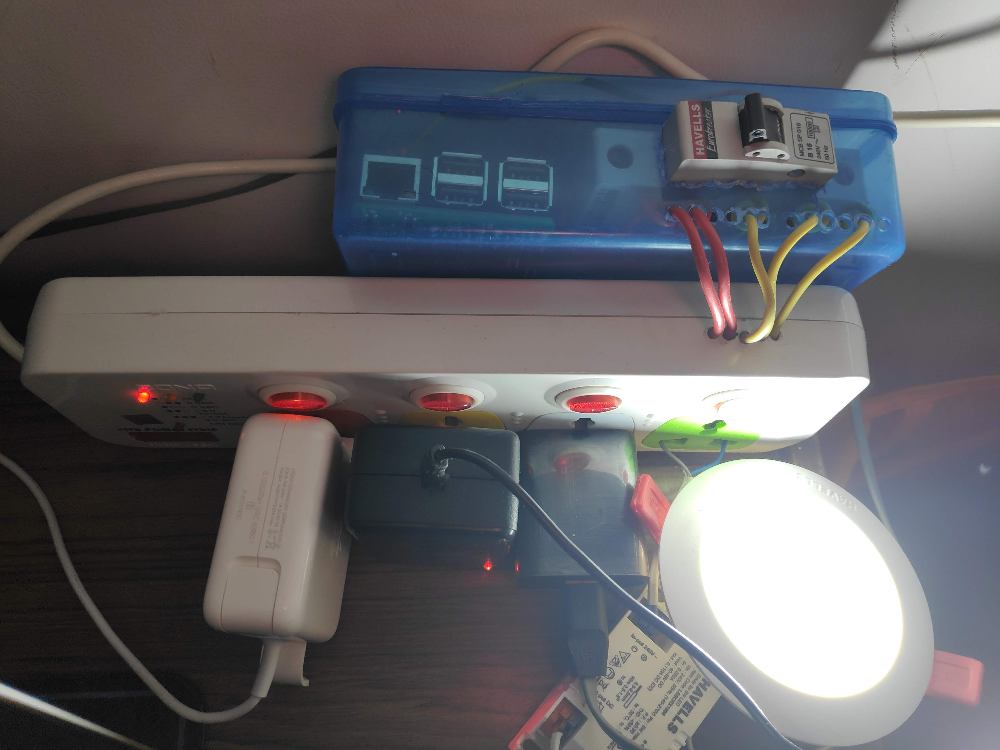

# autopi

A Raspberry pi based iot home automation system and associated [flutter app](https://github.com/markroxor/autopi_flutter).

An ugly preview goes below -  

The extension board is connected to a relay board which is controlled by raspberry pi. Current functionalities include - 
- [x] Use MCB for added protection.
- [x] Control all the switches in the extension board using pi in parallel to the switches already in the board.
- [x] Turn on lights at 7am everyday, overriding all the other settings.
- [x] Turn off all the switches when phone disconnects from the local network.
- [x] Access pi anywhere around the globe using ngrok and send generated url to slack.
- [x] Associate it with the ugly [flutter app](https://github.com/markroxor/autopi_flutter) to override switch states.
- [x] Use supervisor daemon to run all the services at startup and for a miniature orchestration.
